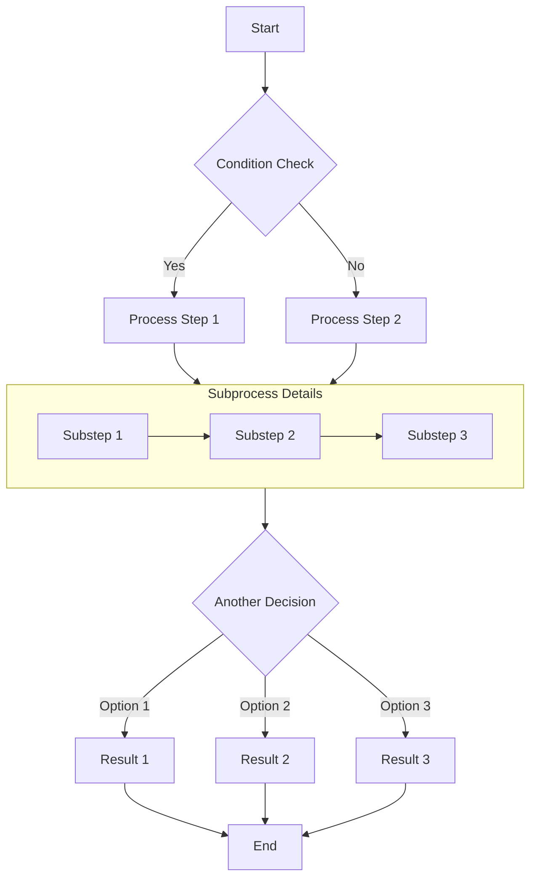
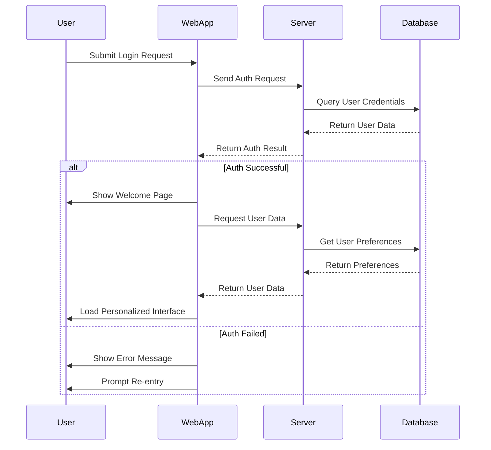
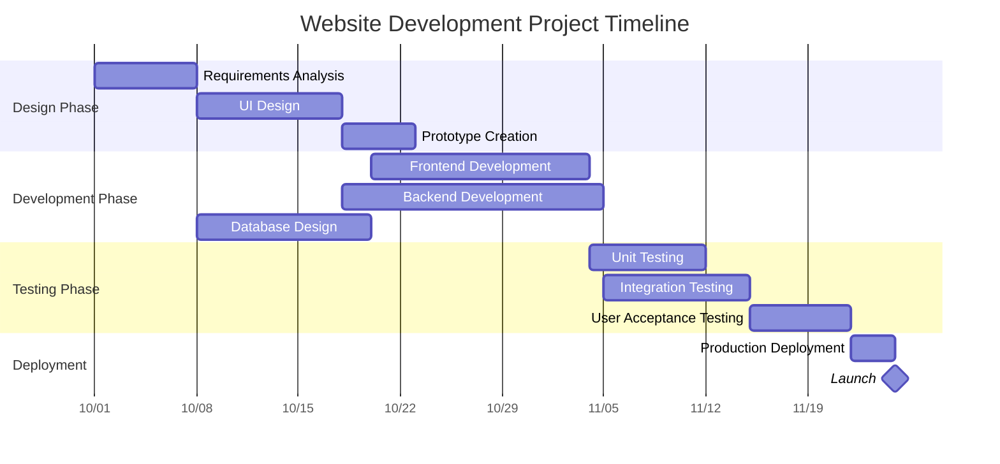
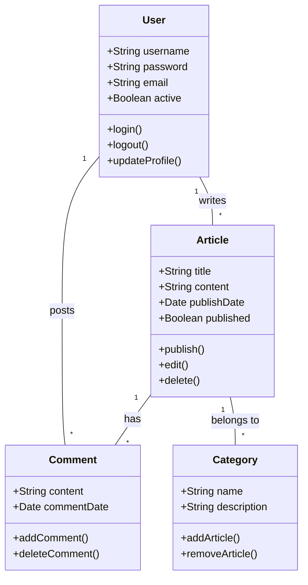
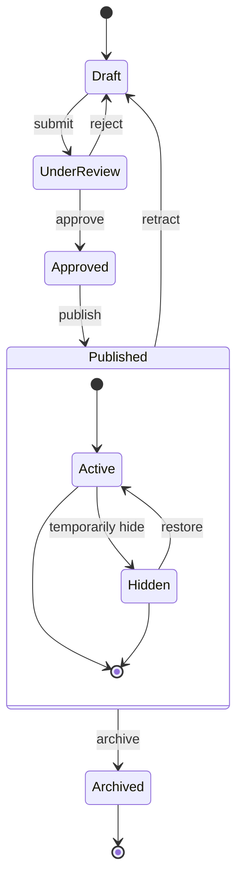
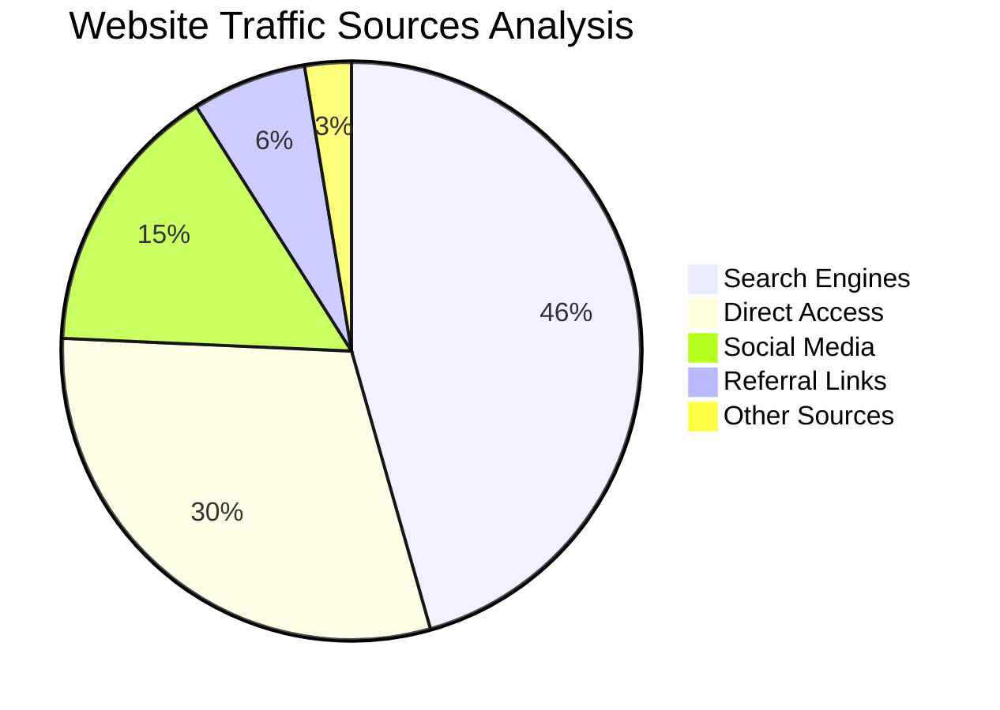

:::note
模板教学说明：这是一篇模板自带的 Mermaid 教学文章，用来演示流程图、时序图、甘特图等图表语法。你可以把它当作语法速查表，也可以删掉后改成自己的图表教程。
:::

# Complete Guide to Markdown with Mermaid Diagrams

This article demonstrates how to create various complex diagrams using Mermaid in Markdown documents, including flowcharts, sequence diagrams, Gantt charts, class diagrams, and state diagrams.

中文翻译：本文演示如何在 Markdown 中使用 Mermaid 绘制常见图表，包括流程图、时序图、甘特图、类图、状态图和饼图。

## Flowchart Example

Flowcharts are excellent for representing processes or algorithm steps.

中文翻译：流程图适合展示流程步骤和算法分支结构。

## Sequence Diagram Example

Sequence diagrams show interactions between objects over time.

中文翻译：时序图用于表达多个对象在时间线上的交互顺序。

## Gantt Chart Example

Gantt charts are perfect for displaying project schedules and timelines.

中文翻译：甘特图适合展示项目排期、任务持续时间和里程碑节点。

## Class Diagram Example

Class diagrams show the static structure of a system, including classes, attributes, methods, and their relationships.

中文翻译：类图用于描述系统的静态结构，包括类、属性、方法及其关系。

## State Diagram Example

State diagrams show the sequence of states an object goes through during its life cycle.

中文翻译：状态图用于描述对象在生命周期中的状态变化过程。

## Pie Chart Example

Pie charts are ideal for displaying proportions and percentage data.

中文翻译：饼图适合展示占比和百分比类数据。

## Conclusion

Mermaid is a powerful tool for creating various types of diagrams in Markdown documents. This article demonstrated how to use flowcharts, sequence diagrams, Gantt charts, class diagrams, state diagrams, and pie charts. These diagrams can help you express complex concepts, processes, and data structures more clearly.

To use Mermaid, simply specify the mermaid language in a code block and describe the diagram using concise text syntax. Mermaid will automatically convert these descriptions into beautiful visual diagrams.

Try using Mermaid diagrams in your next technical blog post or project documentation - they will make your content more professional and easier to understand!

中文翻译：Mermaid 能让技术文档与博客中的结构化信息更直观。你只需在代码块中使用 `mermaid` 语法，即可自动生成图表。建议在后续文章中尝试使用，以提升可读性与专业度。